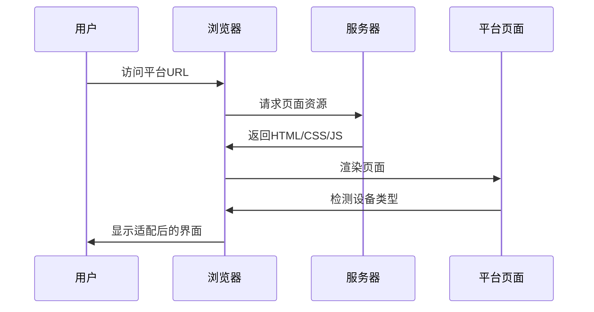
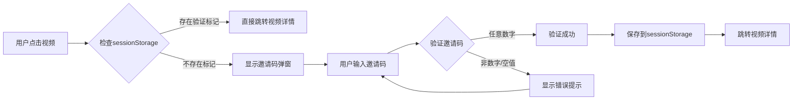
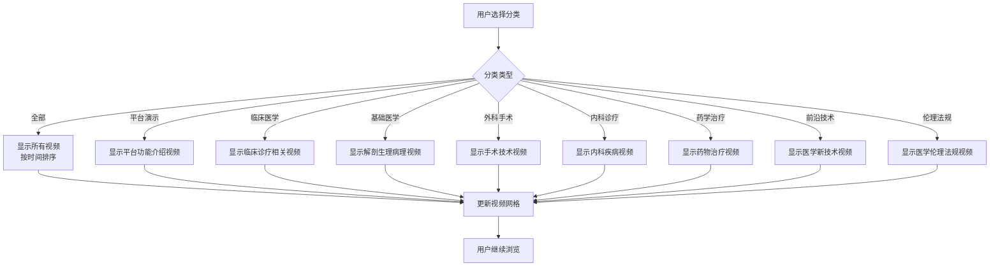
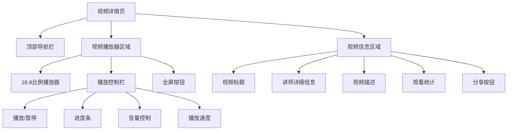
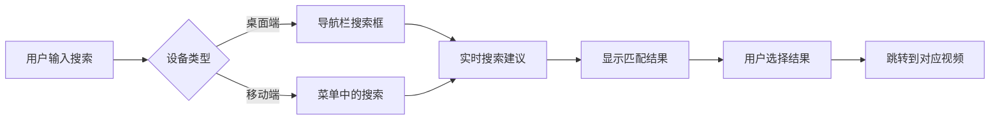
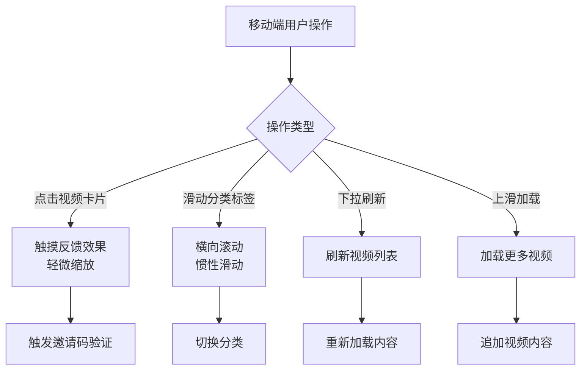
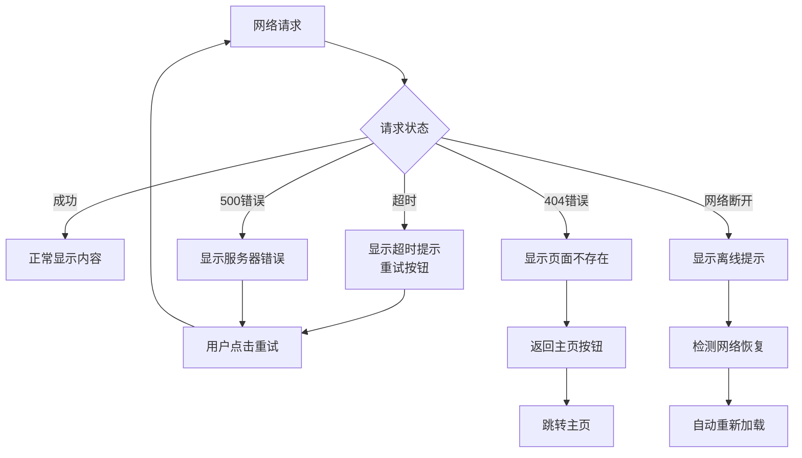
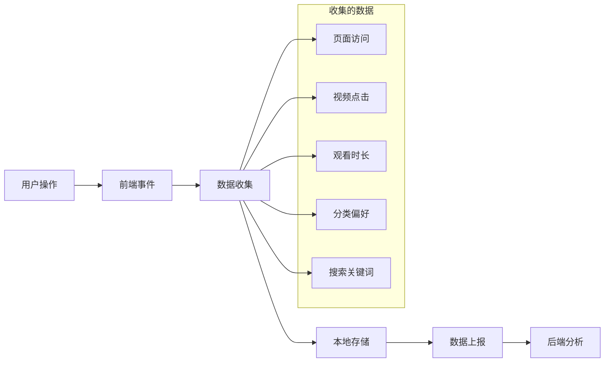
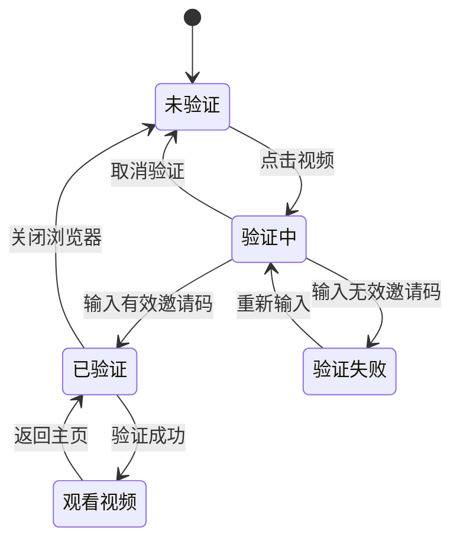

# 🔄 H5医学科普视频平台产品流程图

## 📋 流程图概述

本文档详细描述了奥友医学科普视频平台的完整用户流程，包含主流程、分支流程、邀请码验证机制以及各种异常处理场景。

## 🎯 核心流程说明

### 流程特点
- **会话级邀请码验证** - 每次新打开浏览器需要验证
- **YouTube风格界面** - 现代化的视频浏览体验
- **响应式设计** - 支持桌面端和移动端
- **7个医学分类** - 专业的医学内容分类

## 📊 完整产品流程图

```mermaid
flowchart TD
    A[用户访问平台] --> B{检查设备类型}
    
    B -->|桌面端| C[显示完整导航栏<br/>Logo + 搜索框 + 用户头像]
    B -->|移动端| D[显示简化导航栏<br/>Logo + 用户头像]
    
    C --> E[加载主页面]
    D --> E
    
    E --> F[显示分类标签栏<br/>全部|平台演示|临床医学|基础医学|外科手术|内科诊疗|药学治疗|前沿技术|伦理法规]
    
    F --> G[加载视频网格]
    G --> H{检查屏幕尺寸}
    
    H -->|桌面端 >1024px| I[多列网格布局<br/>4-5列显示]
    H -->|平板端 768-1023px| J[中等网格布局<br/>2-3列显示]
    H -->|移动端 <768px| K[单列布局<br/>垂直排列]
    
    I --> L[用户浏览视频]
    J --> L
    K --> L
    
    L --> M{用户操作选择}
    
    M -->|点击分类标签| N[筛选对应分类视频]
    M -->|使用搜索功能| O[搜索相关视频]
    M -->|点击视频卡片| P{检查验证状态}
    
    N --> G
    O --> Q[显示搜索结果]
    Q --> L
    
    P -->|已验证| R[直接跳转视频详情页]
    P -->|未验证| S[显示邀请码弹窗]
    
    S --> T[邀请码验证流程]
    
    T --> U{用户输入邀请码}
    
    U -->|输入任意数字| V[验证成功]
    U -->|输入非数字| W[显示错误提示<br/>请输入数字邀请码]
    U -->|输入为空| X[显示提示<br/>请输入邀请码]
    U -->|点击取消| Y[关闭弹窗<br/>返回主页]
    
    W --> T
    X --> T
    Y --> L
    
    V --> Z[保存验证状态到sessionStorage]
    Z --> AA[显示成功提示<br/>邀请码验证成功]
    AA --> R
    
    R --> BB[视频详情页]
    BB --> CC[显示视频播放器<br/>16:9比例]
    CC --> DD[显示视频信息<br/>标题|讲师|描述|观看数]
    
    DD --> EE{用户操作}
    
    EE -->|播放视频| FF[开始播放<br/>记录观看行为]
    EE -->|返回主页| GG[返回视频列表]
    EE -->|分享视频| HH[调用分享功能]
    
    FF --> II{播放状态}
    II -->|正常播放| JJ[更新观看进度]
    II -->|播放错误| KK[显示错误信息<br/>重试选项]
    
    JJ --> LL[播放完成]
    KK --> FF
    
    LL --> MM[更新观看统计]
    MM --> NN[推荐相关视频]
    
    GG --> L
    HH --> OO[分享成功提示]
    OO --> DD
    
    NN --> PP{用户选择}
    PP -->|观看推荐视频| P
    PP -->|返回主页| GG
    
    %% 会话管理流程
    QQ[浏览器关闭] --> RR[清除sessionStorage]
    RR --> SS[下次访问需重新验证]
    SS --> A
    
    %% 错误处理流程
    TT[网络错误] --> UU[显示错误页面<br/>重试按钮]
    UU --> VV{用户操作}
    VV -->|点击重试| A
    VV -->|刷新页面| A
    
    %% 移动端特殊流程
    WW[移动端分类滚动] --> XX[横向滑动分类标签]
    XX --> YY[选择分类]
    YY --> N
    
    %% 搜索流程详细
    ZZ[搜索功能] --> AAA{设备类型}
    AAA -->|桌面端| BBB[显示搜索框]
    AAA -->|移动端| CCC[搜索框隐藏<br/>可通过菜单访问]
    
    BBB --> DDD[输入搜索关键词]
    CCC --> DDD
    DDD --> EEE[实时搜索建议]
    EEE --> FFF[显示搜索结果]
    FFF --> Q
    
    style A fill:#e1f5fe
    style S fill:#fff3e0
    style V fill:#e8f5e8
    style W fill:#ffebee
    style BB fill:#f3e5f5
    style FF fill:#e0f2f1
```

## 🔍 详细流程说明

### 1. 用户访问流程

#### 1.1 初始访问


#### 1.2 设备适配
- **桌面端** (>1024px):
  - 完整导航栏 (Logo + 搜索框 + 用户头像)
  - 多列视频网格 (4-5列)
  - 悬停效果和动画

- **平板端** (768-1023px):
  - 适中导航栏
  - 中等网格布局 (2-3列)
  - 触摸和鼠标双重支持

- **移动端** (<768px):
  - 简化导航栏 (隐藏搜索框)
  - 单列垂直布局
  - 分类标签横向滚动

### 2. 邀请码验证流程

#### 2.1 验证触发条件


#### 2.2 验证规则
- **有效邀请码**: 任意数字组合 (如: 1234, 888, 2024)
- **无效邀请码**: 包含字母、特殊字符或为空
- **验证状态**: 保存在sessionStorage中
- **有效期**: 当前浏览器会话 (关闭浏览器后清除)

#### 2.3 验证状态管理
```javascript
// 检查验证状态
function isVideoAccessVerified() {
    return sessionStorage.getItem('aoyou_video_access_verified') === 'true';
}

// 设置验证状态
function setVideoAccessVerified() {
    sessionStorage.setItem('aoyou_video_access_verified', 'true');
}

// 重置验证状态 (调试用)
function resetVideoAccess() {
    sessionStorage.removeItem('aoyou_video_access_verified');
}
```

### 3. 视频浏览流程

#### 3.1 分类筛选


#### 3.2 视频卡片信息
每个视频卡片包含:
- **缩略图**: 16:9比例，支持懒加载
- **时长标签**: 右下角显示 (如: 5:20)
- **新视频徽章**: 右上角红色标签
- **讲师头像**: 圆形头像，36px
- **视频标题**: 最多显示2行
- **讲师信息**: 姓名和职称
- **元数据**: 观看次数、发布时间

### 4. 视频播放流程

#### 4.1 视频详情页结构


#### 4.2 播放状态管理
- **播放开始**: 记录观看行为
- **播放进度**: 实时更新观看进度
- **播放完成**: 更新完播统计
- **播放错误**: 显示错误信息和重试选项

### 5. 搜索功能流程

#### 5.1 搜索触发


#### 5.2 搜索范围
- **视频标题**: 主要搜索字段
- **讲师姓名**: 按讲师搜索
- **视频描述**: 内容关键词
- **分类标签**: 按分类搜索

### 6. 移动端特殊流程

#### 6.1 触摸交互


#### 6.2 移动端优化
- **最小触摸目标**: 44px × 44px
- **滑动手势**: 支持惯性滑动
- **触摸反馈**: 视觉和触觉反馈
- **键盘适配**: 输入时避免遮挡

### 7. 异常处理流程

#### 7.1 网络异常


#### 7.2 验证异常
- **邀请码格式错误**: 提示输入数字
- **验证状态丢失**: 重新验证
- **弹窗显示异常**: 刷新页面
- **会话过期**: 清除状态重新验证

### 8. 数据流转图

#### 8.1 用户行为数据


#### 8.2 验证状态流转


## 🎯 关键业务指标

### 用户行为指标
- **页面访问量** (PV): 总页面浏览次数
- **独立访客数** (UV): 独立用户访问数
- **会话时长**: 用户单次访问时长
- **跳出率**: 单页面访问后离开的比例

### 邀请码验证指标
- **验证成功率**: 成功验证的用户比例
- **验证失败次数**: 输入错误邀请码的次数
- **验证放弃率**: 取消验证的用户比例
- **重复验证率**: 同一用户多次验证的比例

### 视频观看指标
- **视频点击率** (CTR): 视频被点击的比例
- **观看完成率**: 完整观看视频的比例
- **平均观看时长**: 用户平均观看时间
- **视频分享次数**: 视频被分享的次数

### 分类偏好指标
- **分类点击分布**: 各分类的点击比例
- **分类观看时长**: 各分类的观看时长
- **热门视频排行**: 最受欢迎的视频内容
- **搜索热词**: 用户搜索的关键词

## 📱 移动端流程特殊说明

### 移动端导航流程
1. **简化导航**: 隐藏搜索框，保留核心功能
2. **分类滚动**: 支持横向滑动切换分类
3. **单列布局**: 视频采用垂直单列排列
4. **触摸优化**: 所有交互元素适配触摸操作

### 移动端邀请码流程
1. **弹窗适配**: 弹窗尺寸适配移动端屏幕
2. **键盘处理**: 输入时避免键盘遮挡弹窗
3. **触摸反馈**: 按钮点击提供触觉反馈
4. **手势支持**: 支持滑动关闭弹窗

## 🔧 技术实现要点

### 前端技术栈
- **HTML5**: 语义化标签，支持视频播放
- **CSS3**: 响应式布局，动画效果
- **JavaScript ES6+**: 模块化开发，异步处理
- **sessionStorage**: 会话级数据存储

### 关键技术实现
- **响应式设计**: CSS媒体查询实现多端适配
- **懒加载**: 图片和视频的按需加载
- **缓存策略**: 合理的资源缓存机制
- **错误处理**: 完善的异常捕获和处理

### 性能优化
- **首屏加载**: 优先加载关键资源
- **图片优化**: WebP格式，多尺寸适配
- **代码分割**: 按需加载非关键代码
- **CDN加速**: 静态资源CDN分发

---

**文档版本**: v1.0  
**创建日期**: 2024年10月21日  
**适用范围**: 产品经理、UI设计师、开发工程师